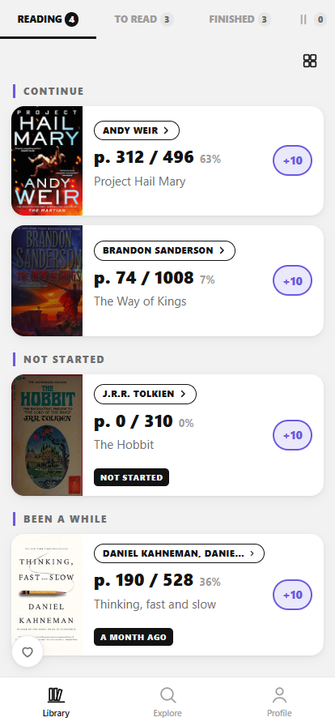

# BooksTable

A personal reading tracker: what you are reading, what page you are on, what
comes next. Runs on the web, iPhone and Android from one codebase, and keeps
your library on the device. No backend, no account, no API key.

**Try it:** [live app](https://books-table-six.vercel.app/) ·
[iOS beta on TestFlight](https://testflight.apple.com/join/554r8QcA) ·
[GitHub Pages mirror](https://mrwd.github.io/books-table/) ·
[product page](https://mrwd.github.io/products/books-table/)



Book metadata comes from Open Library. Built on the same skeleton as
[FilmTable](https://github.com/mrWD/film-table) and
[GamesTable](https://github.com/mrWD/games-table): same stack, same local-first
principles, a different domain. The platform code the three share (storage,
native bridges, backups) lives in [tables-core](https://github.com/mrWD/tables-core).

## Features

- **Library** — one screen, four tabs carrying their counts: Reading, To read,
  Finished, and an icon tab for books put down unfinished. Reading splits into
  Continue, Not Started and Been a While; a card shows the position
  (`p. 124 / 504`), the percentage and a one-tap `+10` advance with Undo, plus a
  list/grid toggle.
- **Book page** — progress with quick `+10 / +25 / +50` steps or an exact page,
  a page count you can correct for your own edition, your own 1–5 rating, and
  Start reading / Give up / Read again / Remove.
- **START asks, then moves you** — on a To read row it opens a two-option sheet
  ("I'm reading it now" / "I've already read it") and switches to the tab the book
  landed on, instead of leaving you to find where it went.
- **"For you" recommendations** — built on the device from what is on your
  shelves: the authors you finished and the subjects those books share. Finished
  books weigh more than a wish-list entry, anything already in the library is
  excluded, and every card states why it was suggested.
- **Explore** — search scoped to **ALL / TITLE / AUTHOR**, what is trending this
  week, and a genre strip.
- **Profile** — pages, reading time, a year in review with a per-month shape,
  shelves by status, **JSON backup export/import** and a full reset.
- **Theme** — light and dark, following the device by default; Profile →
  Appearance can pin either one. Applied before the first paint, so there is no
  flash of a light background at startup.
- **PWA** — installs to the home screen and works offline (service worker).

## Native apps

The same build ships as a Capacitor app for iOS and Android. On top of the web
features, the iOS app has:

- **Home-screen widgets**: Reading and To read, fed by a snapshot the app
  writes into a shared App Group (`ios/App/BooksTableWidget`). The widget uses
  the same progress helpers as the shelves, so the numbers never disagree.
- **Translate the description**: Open Library publishes in English only. On
  iOS 17.4+ the book page can translate the description with Apple's on-device
  Translation framework; the original stays one tap away, because translation
  mangles proper nouns.
- **One reminder, not a feed**: if the app has not been opened for three days
  and a book is mid-read, one evening notification says so. Daily readers never
  see it.
- **Backups**: the JSON backup goes through the system share sheet, so it can
  land in Files, iCloud or a message.

The bridge to Apple's on-device language model (`ios/App/App/AIBridge.swift`)
is ported from FilmTable and wired up, but no feature uses it here yet.

Nothing in the native app sends your library anywhere either. iOS is in open
TestFlight; the App Store and Google Play listings are not published yet
(the drafts are in [docs/STORE.md](docs/STORE.md)).

## Data

| Source | What | Key |
|---|---|---|
| [Open Library](https://openlibrary.org/developers/api) | search, works, covers, trending, subjects | not required |

One source covers everything, which is why this project has no server at all.
Measured against the live API while building:

- Every endpoint sends `access-control-allow-origin: *`, so the browser talks to
  it directly — no proxy, no key, nothing to keep secret.
- Search takes about **2 s**. That is why the search box debounces at 450 ms and
  why supplementary calls are wrapped in a timeout.
- Cyrillic queries work (`Булгаков` → 583 results), though coverage of Russian
  editions is thinner than English.
- **Genre browsing goes through `search.json?q=subject:X&sort=rating`, not
  `/subjects/<slug>.json`.** The subjects endpoint ranks by edition count, which
  makes the same public-domain classics top every genre — *Alice's Adventures in
  Wonderland* was the first result for both Fantasy and Science Fiction. Ranking
  the search index by rating returns what a reader would recognise as the genre.
- Google Books was evaluated as a second source and rejected for now: without a
  key it answers **HTTP 429** with `quota_limit_value: "0"`, so it would need a
  key and therefore a server.

User data lives only on the device: IndexedDB (`bookstable-kv`) in a browser, a
JSON file in the app's private storage in the native apps, where the OS cannot
reclaim it as site data. Small preferences stay in `localStorage`. There is no
sync between devices — move your library via Profile → Export/Import. The
details, and the one-way migration from the old `localStorage` library, are in
[docs/ARCHITECTURE.md](docs/ARCHITECTURE.md).

## Running locally

```bash
npm install
npm run dev
```

Production build:

```bash
npm run build
```

`npm run preview` serves the build on <http://localhost:4173>, and
`node scripts/gen-icons.mjs` regenerates the PNG icons from `public/favicon.svg`.

Native shells: `npm run build:native` builds with the native flag, then
`npx cap sync` copies the result into `ios/` and `android/`.
`scripts/release-ios.sh <build-number>` archives and exports a signed `.ipa`;
what it does and where a person has to take over is in
[docs/RELEASE-IOS.md](docs/RELEASE-IOS.md).

## Deployment

Static files only — routing is hash-based, so no SPA fallback is needed and the
build ports to any host. A push to `main` publishes twice: Vercel rebuilds
<https://books-table-six.vercel.app/> from the root, and
`.github/workflows/deploy.yml` publishes the GitHub Pages mirror with the subpath
injected via `BASE_PATH`. That variable belongs to Pages alone — setting it on a
root host would move every asset into a subpath that is not there.

On a `.vercel.app` host the app also reports cookieless screen-view counts to
Vercel Web Analytics: a screen name, never a title, a search term or an
identifier. Everywhere else the component is inert.

## Layout

```
src/lib/        types, the Open Library client, subject vocabulary, formatting,
                and the native bridges: widget, translate, reminders, ai
src/store/      zustand: library and cache (persist), explore, recommend, theme, ui
                selectors.ts — all derived logic as pure functions
src/components/ icons, UI primitives, cards
src/pages/      Library / Explore / BookDetail / Profile / Insights
ios/            Capacitor iOS project, Swift bridges and the widget extension
android/        Capacitor Android project
scripts/        icon generation, iOS release, widget target setup
```

## Documentation

| File | What it covers |
|---|---|
| [CLAUDE.md](CLAUDE.md) | project context, principles, how to verify |
| [docs/ARCHITECTURE.md](docs/ARCHITECTURE.md) | data model, progress rules, flows |
| [docs/DATA-SOURCES.md](docs/DATA-SOURCES.md) | Open Library's quirks, confirmed by measurement |
| [docs/RELEASE-IOS.md](docs/RELEASE-IOS.md) | building and uploading the iOS app, and the traps |
| [docs/STORE.md](docs/STORE.md) | store listing drafts and screenshots |

## Licence

MIT. Book data from Open Library, a project of the Internet Archive.
